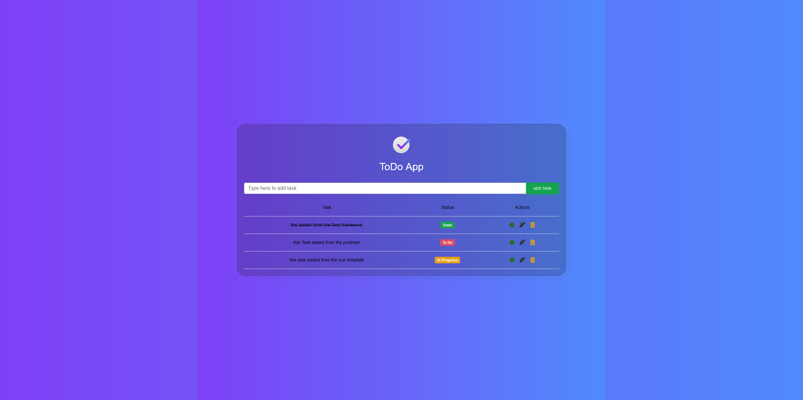

# Django-Vue.js ToDo App

This is a simple ToDo application built using Django for the backend and Vue.js for the frontend.

## Features

- Add tasks with status
- Edit existing tasks
- Mark tasks as done
- Delete tasks

## Technologies Used

- Django
- Django REST Framework
- Vue.js
- Axios
- SQLite (default database)

## Getting Started

To get a local copy up and running follow these simple steps.

### Prerequisites

- Python 3.x
- Node.js
- npm (Node Package Manager)

### Installation

1. Clone the repository:

   ```bash
   git clone https://github.com/AhmedTarek111/ToDo-App-Django-vuejs.git

### Screen Shot 
